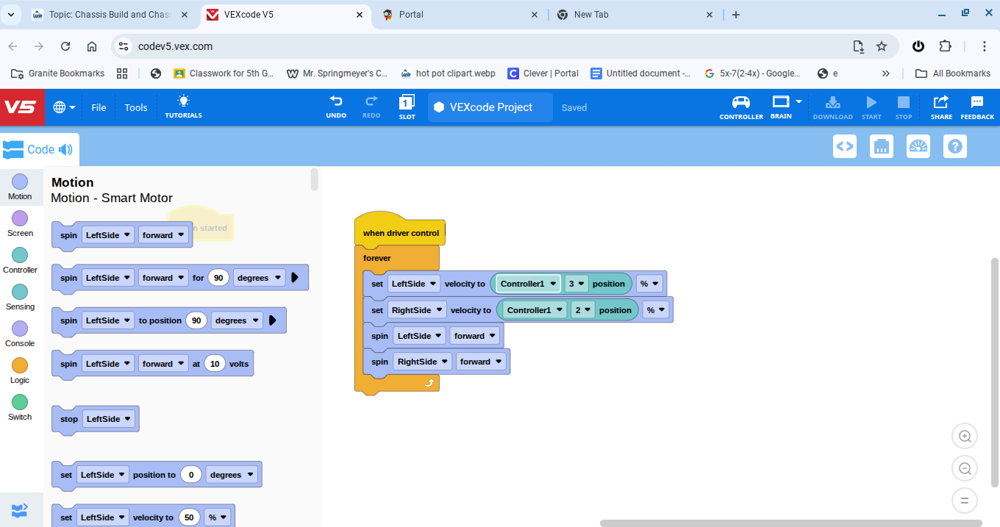

# NeuroKey

## Team members:
George Huang - Documenter/Coder
Alan Huang - Coder
James Stacey- Driver/builder
Noah Gonzalez- Builder

## Robot name: Typo

## Mission: Robot that can move freely and able to reach and type on each key on a standard full size keyboard.
Goal is to type a whole sentance with robotic finger. Size is around a foot tall, rectanglular outline with a pole/finger to slide down and type each key with accuracy. Both the mobile function and finger will be controlled by a person, if possible in the future, make it automatic. 

## Parts List

2 Aluminium C-Bars, 25 units

2 Aluminum C-Bars, 20 units
2 Aluminum C-Bars, 15 units
2 V5 Motors
Axles
1 V5 Robot Brain
Gears
Power Cables
1 v5 Robot Battery
2 Battery Clips
Hex Nuts
1 Bag Post hex Nut Retainer with Bearing Flat
Vex V5 Controller
1 Tank Trend upgrade kit

## Images:
### Chassis Build Plan:

### Source code

