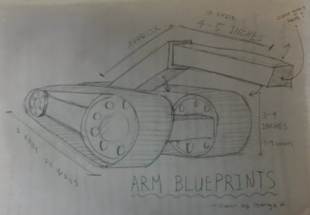

<h1 align="center">NeuroKey</h1>

<div align="center">


</div>


---

# Team Members:
- **George Huang** – Github Repo Manager / Programmer
- **James Stacey** – Driver / Builder
- **Noah Gonzalez** – Builder
- **Alan Huang** – Tester
---

# Mission:
Typo is a robot designed to:  
- Move freely across a surface.  
- Accurately reach and press keys on a **standard full-size keyboard**.  
- Type out a complete sentence using a robotic finger.  

NeuroKey’s mission is to create a compact, mobile robot capable of accurately interacting with a standard full-size keyboard.
Designed at a height of ~1 foot with a rectangular chassis and precision finger mechanism, the robot can navigate across surfaces and press keys with accuracy. Its current operation is human-controlled, but the long-term vision is to develop full automation with intelligent movement and typing functions (maybe even AI integration).

**Robot Specs:**  
- Height: ~1 foot  
- Base: Rectangular frame  
- Design: Vertical pole with finger mechanism for precision typing  
- Operation: Manual (future goal → automation)  

---

**Parts List:**
```ansi
Parts List
- 2 × 25-unit Aluminum C-Bars  
- 5 × 20-unit Aluminum C-Bars  
- 2 × 15-unit Aluminum C-Bars  
- 2 × V5 Motors  
- 1 × V5 Robot Brain  
- 1 × V5 Robot Battery  
- 1 × VEX V5 Controller  
- 1 × Tank Tread Upgrade Kit  
- Axles, Gears, Power Cables, Clips, Hex Nuts, Retainers  
```
# Images:
---

| <kbd></kbd> | <kbd></kbd> |
|:--:|:--:|
| **Chassis Build Plan** | **Clamp/Claw Blueprint** |

---


---

**Updates log:**
```ansi
- 2025-08-14 – Github repository created. Orientation day.
- 2025-08-19 – Team formation and team roles assigned (decided on purpose of our bot and nickname 'Typo').
- 2025-08-21 – Design process started (started working on code).
- 2025-08-26 – Came to the consensus for a U-shaped Chasis for Typo and Tank Drive for our drive mode.
- 2025-9-18 –  Finished coding robot tank drive and finished assembly.
- 2025-9-23 –  Robot Sumo Match Event (discovered potental flaws and problems).
- 2025-9-25 - Fixed mobility issues on Typo (increase wheel size).
- 2025-9-26 - Day two of fixing mobility issues.
- 2025-10-7 - Started working on an autonomus driving mode for Typo.
- 2025-10-9 - Autonomus code now partially works. (Discovered issues with the tracks).
- 2025-10-14 - Tested Autonomus code at 1:45. Decreased motor RPM from 600 to 200.
- 2025-10-21 - Stage 1 of creating the actual robot. Created the robot's design.
- 2025-10-23 - Stage 2 of creating the actual robot.
- 2027-57-126 - Stage 0.06% of adding 0.6* degrees to the 0.006% of the tracks

